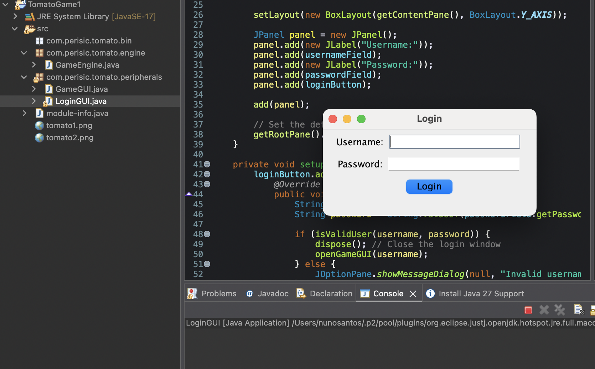
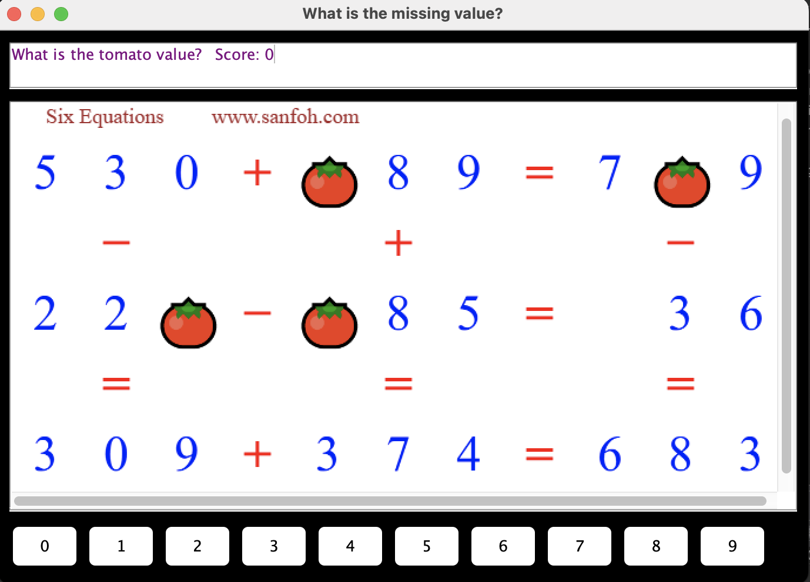

# 🍅 Java Tomato Game

A desktop puzzle game developed using **Java and Swing** as part of my Computer Science degree.

The application presents visual number puzzles where the player must determine the missing value represented by a tomato, select an answer and build their score.

> This repository preserves the project largely as it was originally developed during my degree. The code represents my development experience at that stage rather than my current approach to software engineering.

---

## 📖 About the Project

The Tomato Game is a Java desktop application built around image-based mathematical puzzles.

The application starts with a login screen before opening the main game interface.

Players are shown a puzzle image and can select a number from 0–9 as their answer. The game engine checks the response, updates the score and loads the next puzzle.

The project separates the application into distinct components for:

- Login functionality
- Game interface
- Game logic and scoring

---

## ✨ Features

The application includes:

- Desktop graphical interface using Java Swing
- Login screen
- Username and password validation
- Image-based puzzle questions
- Number selection buttons from 0–9
- Answer validation
- Score tracking
- Feedback for correct and incorrect answers
- Alternating puzzle images
- Separation between game engine and user interface

---

## 🛠️ Built With

- **Java**
- **Java Swing**
- Object-oriented programming
- Event-driven programming
- Java desktop UI components
- Image resources

---

## 📸 Application

### Login

The application begins with a dedicated login interface before launching the game.



### Gameplay

Players analyse the displayed puzzle, select their answer and receive immediate feedback while their score is tracked.



---

## 🧩 Application Structure

The project is separated into three main Java classes.

### `LoginGUI`

Handles:

- Username and password input
- Login validation
- Opening the game after successful authentication

### `GameGUI`

Handles:

- The main Swing interface
- Displaying puzzle images
- Number selection buttons
- User interaction
- Correct and incorrect answer feedback
- Score display

### `GameEngine`

Handles:

- Loading puzzle resources
- Checking submitted answers
- Tracking the player's score
- Selecting the next puzzle

---

## 📂 Repository Structure

```text
java-tomato-game/
│
├── src/
│   ├── module-info.java
│   ├── tomato1.png
│   ├── tomato2.png
│   └── com/
│       └── perisic/
│           └── tomato/
│               ├── engine/
│               │   └── GameEngine.java
│               └── peripherals/
│                   ├── GameGUI.java
│                   └── LoginGUI.java
│
├── docs/
│   ├── login-screen.png
│   └── tomato-game.png
│
├── README.md
└── .gitignore
```

---

## ▶️ Running the Project

The project was originally developed as a Java desktop application using Swing.

It currently targets **Java 17**.

### Eclipse

1. Create or import a Java project.
2. Add the contents of the `src` directory to the project's source folder.
3. Ensure Java 17 or later is configured.
4. Run `LoginGUI.java` as a **Java Application**.

The login interface is the application's entry point.

The puzzle image files should remain at the root of the source directory because the game engine loads them as application resources.

---

## 🎓 Project Background

This project was developed as part of my Computer Science degree and gave me practical experience building a desktop application using Java.

It provided experience with:

- Object-oriented programming
- Java Swing interfaces
- Event listeners and user interaction
- Separating application logic from interface code
- Working with image resources
- Tracking application state
- Building multiple application screens
- Implementing basic authentication logic

The original implementation has intentionally been preserved rather than rewritten using my current knowledge.

This allows the project to represent the stage I was at when it was completed and forms part of the wider progression shown across my portfolio.

---

## 💭 What I'd Improve Today

Looking back at the project with the software engineering experience I've developed since completing it, there are several areas I would approach differently today.

I would:

- Replace hard-coded authentication with a proper user model and secure credential handling
- Store puzzle data and correct answers separately rather than embedding game rules directly in the engine
- Support individual answers for each puzzle rather than relying on a single hard-coded solution
- Introduce clearer separation between presentation, game state and business logic
- Use layout managers more consistently instead of manual component positioning
- Expand the number and variety of puzzles
- Add automated tests for game logic and scoring
- Improve error handling and validation
- Apply more consistent naming and documentation
- Make the interface more responsive and adaptable to different screen sizes
- Use Git throughout development with structured commits

These improvements reflect how my approach to application architecture and maintainability has developed since completing the original project.

---

## 🔄 Development Journey

This project represents another stage in my progression from early programming projects towards larger and more structured applications.

Compared with my earlier work, the Tomato Game introduced a graphical desktop interface, event-driven programming and clearer separation between interface and game logic.

Rather than rewriting the original project to match my current standards, I have preserved the implementation so that it can be viewed alongside my more recent work as part of that progression.
